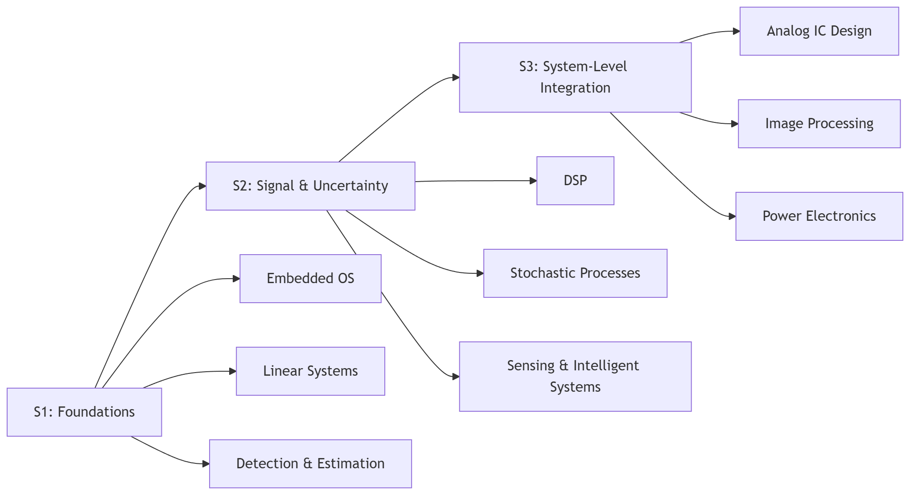
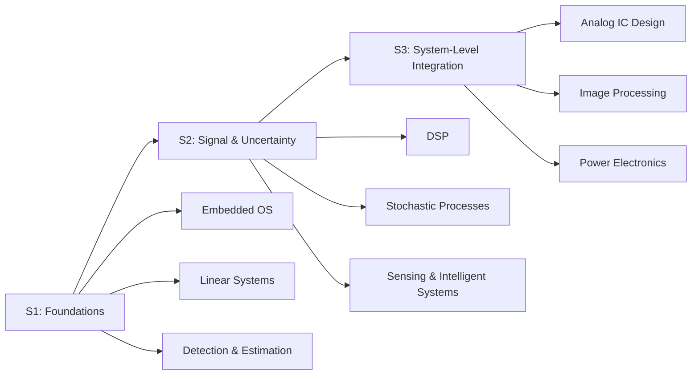

# 嚴浤祐｜作品集式履歷與研究所讀書計畫

> 我把履歷寫成一份更方便用於版本控制的 Markdown 文件：  

- Email: `elvisyen0727@gmail.com`
- GitHub: <https://github.com/PME26Elvis>

---

## 目錄
1. [摘要](#摘要)
2. [技能樹](#技能樹)
3. [代表專案與經驗](#代表專案與經驗)
4. [研究所修課規劃](#研究所修課規劃)
5. [我大學期間的收穫：用 PID 談自我調整](#我大學期間的收穫用-pid-談自我調整)
6. [附錄](#附錄)

---

## 摘要

我在大學期間累積的核心能力，集中在 **機器人系統整合**、**嵌入式即時推論** 與 **可重現的工程流程**。  
近期作品/經驗包含：  

- 以 ROS 2 節點串接：物件偵測（YOLOv8n）→ Kalman Filter 追蹤 → 軌跡預測 → 策略規劃 → 機械手臂控制。   
- KUKA SCARA 四軸手臂透過 EthernetKRL（EKI）雙向通訊與目標位置轉換，並自建 KRL 即時通訊腳本。  
- 工研院深度學習實習：手勢辨識資料對齊、Domain 增強，提升 YOLOv8 精度。  

---

## 技能樹

### 軟體 / 工程工具
- 語言：**C / C++ / Python**
- 工程工具：Ansys / COMSOL、AutoCAD、MATLAB / LTspice
- 系統整合：ROS 2、DDS/QoS、MQTT、嵌入式部署

### 我會如何把技能用在專案中
1. **定義輸入/輸出與評估指標**（latency、FPS、成功率、抖動…）
2. 快速做出最小可重現的 Prototype
3. 迭代：把不穩定因素參數化並儘可能以程式逐一控制變因做 ablation

---

## 代表專案與經驗

### 1) 桌上型曲棍球機器人系統（ROS 2 架構）
- 系統管線：`YOLOv8n detection → Kalman tracking → trajectory prediction → strategy → arm control`
- 我負責/貢獻（摘要）：
  - 自建資料集與後處理（最大信心選擇、動態閾值/平滑化），提升高速雜訊環境下辨識穩定度
  - 控制/通訊：KUKA SCARA + EKI 雙向通訊，完成目標位置轉換與即時腳本

### 2) XRCE-LINK-LAB：從 CI 驗證到 ROS 2 圖的微型通訊鏈
- 動機：MCU ↔ ROS 2 整合常因缺板卡、環境不可重現而受阻
- 方法：雙階段驗證流程（CI 虛擬 PTY ↔ 本機 micro-ROS/Agent/ROS 2 Graph），量化頻率與抖動
- 價值：無板可測、雲端可重現、本機可互動，作為團隊/課程快速複製的標準模板

### 3) RUST 原生 ROS 2 Web 輕量監控系統（單檔部署）
- 動機：缺乏 Rust 原生輕量 ROS 2 → Web 監控
- 技術：單一 binary（`rclrs + axum + tokio`）整合訂閱/WS/HTTP
- 價值：即時可視化與拓撲、低依賴、適合邊緣部署

### 4) 工研院深度學習實習（機械所 智慧工廠 AI 應用與視覺技術部）
- 以 HaGRID Dataset 做對齊與 Domain 增強，提升 YOLOv8 精度  
- 火場場景：串接 FLIR A300 熱感相機串流與動態偽彩色化，提升煙霧/低光環境感知能力並生成高品質訓練數據  
- 嵌入式平台維持高 FPS 即時推論：NVIDIA Jetson Orin、ADLINK NeuronBot

---

## 研究所修課規劃

我希望修課能同時滿足三件事：

- **理論補強**：把控制、訊號、隨機系統的直覺變成可推導、可設計的能力  
- **工程落地**：能把理論轉成可測、可維護、可部署的系統  
- **研究延伸**：讓課程內容能接到我的專題與未來研究題目  

- [x] 完成五門核心課程打分表
- [ ] 將 Mermaid 原始碼更新為最新版課表後再輸出圖片
- [ ] 完成 end-to-end 渲染測試（HTML + PDF）

*比起「快」*（~~只求快產出~~），我更在意輸出能否穩定收斂並可重現。
---

### 核心課程偏好打分（5 門）

| 課程 | 興趣（/10） | 職涯相關（/10） | 我想從這門課帶走的能力 |
|---|---:|---:|---|
| 嵌入式作業系統 | 9 | 8 | 即時性、排程、系統資源管理
| 數位訊號處理 | 7 | 5 | 濾波/頻域分析；把量測資料變成可用特徵 |
| 線性系統理論 | 8 | 3 | 建立控制設計的基本功 |
| 類比積體電路設計 | 5 | 6 | 了解前端感測/放大/雜訊 |
| 隨機程序（隨機過程） | 6 | 1 | 隨機建模、噪聲直覺；支援估測/濾波/不確定性分析 |

---

### 三學期修課流程（每學期約 3 門）

| 學期 | 課程 A | 課程 B | 課程 C | 目標 |
|---|---|---|---|---|
| S1 | 嵌入式作業系統 | 線性系統理論 | 檢測與估計理論 | 建立控制/估測骨架，並把工程系統穩定化 |
| S2 | 數位訊號處理 | 隨機程序 | 感測與智慧系統 | 補上訊號與不確定性直覺，強化感測整合 |
| S3 | 類比積體電路設計 | 影像處理 | 電力電子 | 從感測前端到影像/能量鏈，補齊系統觀 |

---

### Mermaid：修課路線圖（原始碼）

*Figure: 修課路線圖（rendered）*
> 上圖為 Mermaid 轉出的靜態圖，便於直接閱讀；下方保留 Mermaid 原始碼，方便版本控制與後續調整。

---

## 我大學期間的收穫：用 PID 適應科技變遷
我在動機系學到 PID 控制，後來發現它不只是控制器公式，更像一種自我調整的深度思維：

- **P（Proportional）**：我對目標偏差的即時反應速度  
  - 例如：發現知識盲區 → 立刻尋找練功小 Project
- **I（Integral）**：我對長期誤差的責任感（是否持續累積改進）  
  - 例如：每週回顧一次卡住的點，從中學習。
- **D（Derivative）**：我能不能從趨勢預測未來的偏差，避免震盪  
  - 例如：專案接近 Deadline 時，不再盲目加功能，改成降低變動、做回歸測試
---
### PID 控制器公式（數學式）

$$
u(t) = K_p e(t) + K_i \int_0^t e(\tau)\, d\tau + K_d \frac{d e(t)}{dt}
$$

> 我希望自己在 AI 浪潮下不只是「追新」，而是把學校訓練出的思維（PID 的三個參數）當成內建控制器：
在快速變動的世界裡，縮短我的 settling time，減少反覆震盪，讓輸出更穩定。

---
## 附錄
### 參考連結 / 工具
- [Pandoc](https://pandoc.org/)

- [Mermaid](https://mermaid.js.org/)

- [PID Controller](https://ctms.engin.umich.edu/CTMS/?example=Introduction&section=ControlPID)
